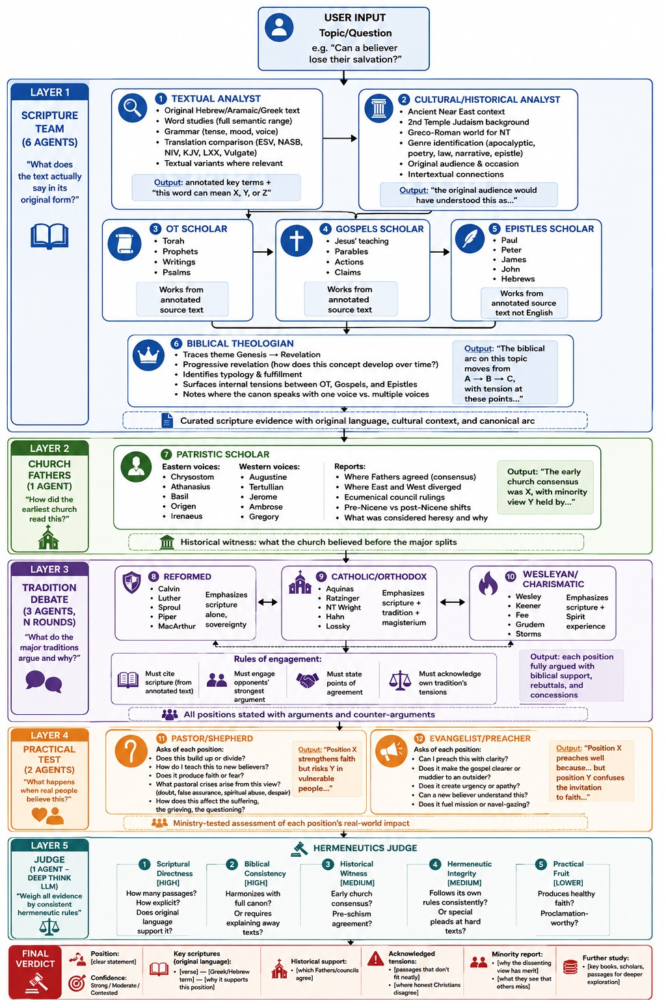

# Bible Study Agents

An open-source, multi-agent system for rigorous theological study. The repository publishes the **system design** and the **full system prompt** for a 12-agent debate pipeline, together with sample dossiers produced by different frontier models.

The goal is simple: make serious, evidence-driven theological reasoning reproducible, auditable, and improvable by anyone who wants to contribute.

## Project Objective

- **Open the design.** Share the 5-layer / 12-agent architecture so others can run it, critique it, and build on it.
- **Open the prompt.** Publish the exact system prompt so results can be reproduced and improved.
- **Invite participation.** Welcome pull requests that improve agent definitions, add new sample topics, tighten hermeneutic guardrails, or port the system to other model families.
- **Stay honest about limits.** Every sample dossier is auditable — evidence, debate moves, concessions, and the final verdict are all shown in the output, not hidden in the model's chain-of-thought.

## How the System Works

The pipeline runs a topic through 5 sequential layers staffed by 12 specialist agents:

1. **Scripture Team** (Agents 1–6) — original-language analysis, cultural/historical context, OT, Gospels, Epistles, biblical theology.
2. **Church Fathers** (Agent 7) — patristic witness across the first centuries.
3. **Tradition Debate** (Agents 8–10) — Reformed, Catholic/Orthodox, and Wesleyan/Charismatic scholars argue across multiple rounds.
4. **Practical Test** (Agents 11–12) — pastoral and evangelistic implications.
5. **Hermeneutics Judge** — evaluates the whole record and issues a final verdict.

Each agent works only from evidence gathered by prior agents, never from assumptions or English translations alone.

See the full prompt: **[prompts/debate.md](prompts/debate.md)**

## Research Dossiers

Sample runs of the system are included as worked examples. They were produced by different frontier models so readers can compare how the same pipeline behaves across model families.

| Topic | Model | Dossier |
| --- | --- | --- |
| Can a believer lose their salvation? | **GPT-5.5** | [research/can-believer-lose-salvation.md](research/can-believer-lose-salvation.md) |
| Is creation young earth or old earth? | **Claude Opus 4.7** | [research/young-or-old-earth-creation.md](research/young-or-old-earth-creation.md) |
| Romans 4 Bible Study | **GPT-5.5 Medium** | [research/romans-4-bible-study.md](research/romans-4-bible-study.md) |

## System Diagram

## Contributing

Contributions are welcome and encouraged. Good places to start:

- **Run a new topic** through the system and submit the dossier under `research/`.
- **Refine an agent's role** in [prompts/debate.md](prompts/debate.md) — tighter scope, better guardrails, clearer outputs.
- **Port the prompt** to another model family and report what changes (Gemini, Llama, Mistral, etc.).
- **Critique a verdict.** If a sample dossier reaches a conclusion you can refute on its own evidence, open an issue with the specific agent and step where you think the reasoning fails.

Open an issue first for larger structural changes (adding layers, removing agents, changing the verdict criteria) so the design discussion happens in the open.
